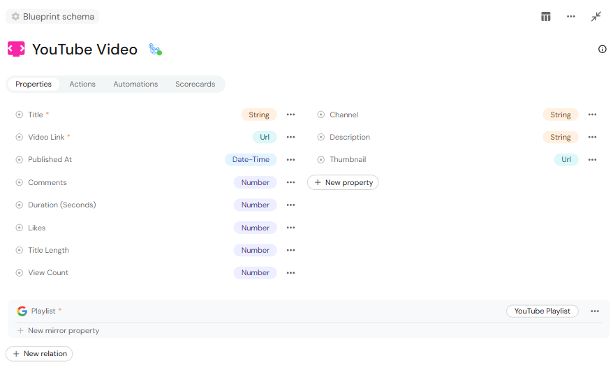
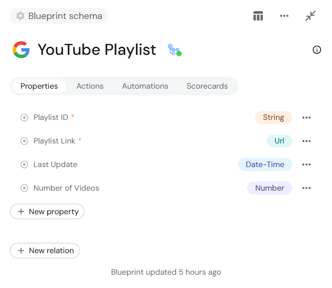
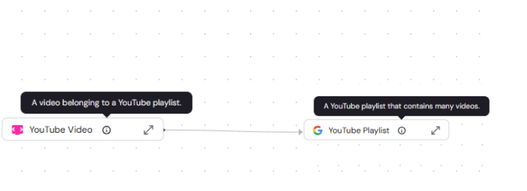
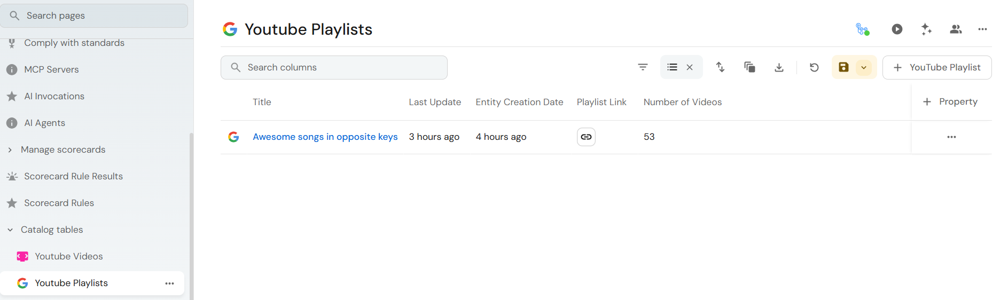
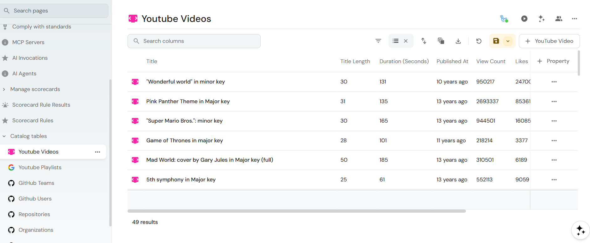
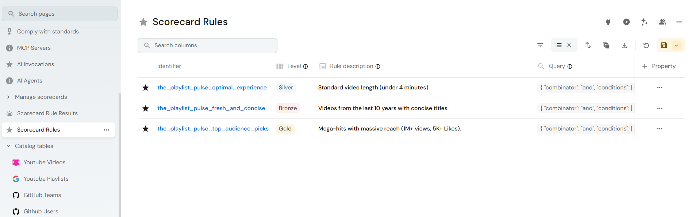
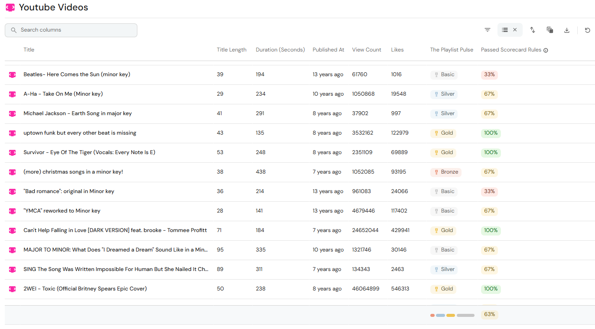
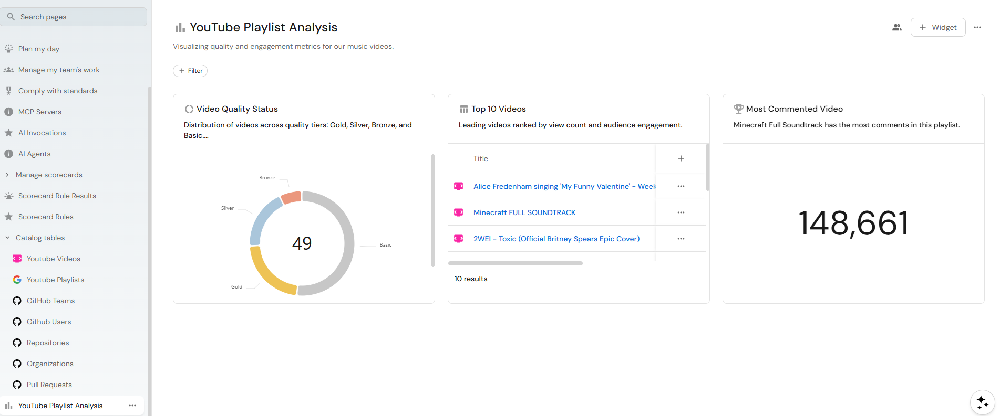
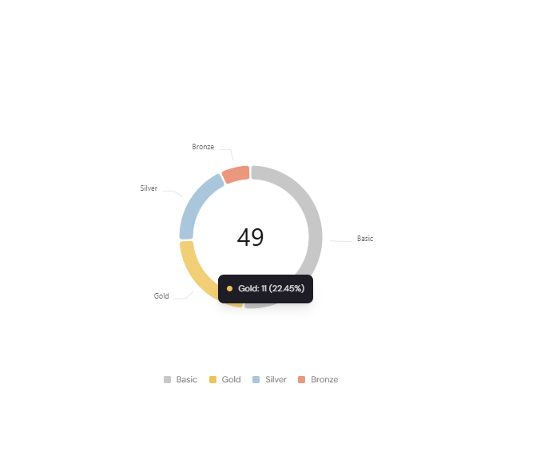
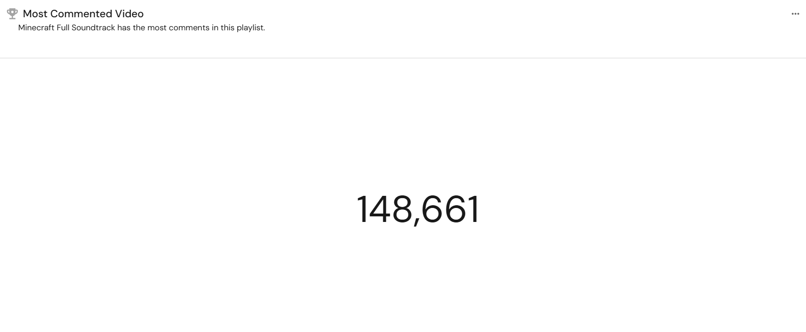

# Ingesting External Data into Port: A Complete Guide

This step-by-step guide explains how to model, ingest, and visualize external data in a developer portal using Port.


While we use a YouTube playlist and its videos as our example, the same pattern applies to any operational source, such as microservices, CI/CD pipelines, monitoring systems, or cloud resources.

By the end of this guide, you will know how to:

* **Ingest** data into Port using automated workflows.
* **Organize** it into a structured, relational catalog.
* **Enforce** standards and quality metrics with scorecards.
* **Create** a clear dashboard for actionable insight

## Table of contents

- [Prerequisites](#prerequisites)
- [Building your software catalog](#building-your-software-catalog)
- [Data Ingestion (GitHub Workflow)](#data-Ingestion)
- [Measuring Quality with Scorecards](#measuring-quality-with-scorecards)
- [Visualizing Insights with Dashboards](#visualizing-insights-with-dashboards)
- [Troubleshooting](#troubleshooting)


## Prerequisites
Before getting started, ensure you have the following:

* **Port Account**: access to your Port instance.
* **GitHub Repository**: used to run the ingestion workflow via GitHub Actions.
* **Youtube Playlist**: we will ingest this playlist: https://www.youtube.com/playlist?list=PL5ErBr2d3QJH0kbwTQ7HSuzvBb4zIWzhy.<br>The workflow only requires the playlist’s unique identifier (`playlistId`), so you can replace it with any playlist later.
* **YouTube API Key**: created in the [Google Cloud Console](https://cloud.google.com/).

### Secure Storage
To keep your credentials safe, add the following as **GitHub Secrets** in your repository settings:
* `PORT_CLIENT_ID` 
* `PORT_CLIENT_SECRET`
* `YOUTUBE_API_KEY`

## Building Your Software Catalog
To create a software catalog in Port, follow these two steps:

* **Define your data model**
* **Ingest data into your catalog**

In order to define your data model, Port provides you with no-code elements called "blueprints" and "relations".


**Blueprints** are the building blocks of your catalog. Think of them as the "classes" or "schemas" for your data.<br>
For this guide, you will create two blueprints: **YouTube Playlist** and **YouTube Video**.

### Setup Blueprints

Blueprints are completely customizable, but they all follow the same basic structure.
| Field           | Description                                                                              | Notes                                        |
|-----------------|------------------------------------------------------------------------------------------|----------------------------------------------|
| `identifier`    | Used for API calls, programmatic access, and distinguishing between blueprints           | Required (max 100 characters)                |
| `title`         | Human-readable name for the blueprint                                                    | Required (max 100 characters)                |
| `description`   | Visible as a tooltip when hovering over the info icon in the UI                          |                                              |
| `icon`          | Icon for the blueprint and its entities                                                  | You can only use icons from a predefined list|
| `schema`        | Object containing `properties` and `required` fields                                     | Required                                     |
| `properties`    | customizable data fields, used to save and display information from external data sources| See the full [properties list](https://docs.port.io/build-your-software-catalog/customize-integrations/configure-data-model/setup-blueprint/properties#supported-properties)|


> [!IMPORTANT]
> Before defining blueprint properties, decide what questions you want to answer.<br>
> A good data model starts from the use-case, not from the API response.

In our case, we want to create a playlist and assess the "video quality" singals of its videos like readability and engagement.

These are the propeties we want to use:

**YouTube Video Blueprint**
| Property         | Type                   | Required | Why we need it                                                       |
| ---------------  | ---------------------- | -------- | -------------------------------------------------------------------- |
| `title`          | `string`               | Yes      | Primary identifier shown in the catalog and search results.          |
| `titleLength`    | `number`               | No       | Enables quality rules (e.g., detect overly long titles).             | 
| `durationSeconds`| `number`               | No       | Helps evaluate viewing experience and filter very long/short videos. |
| `viewCount`      | `number`               | No       | Enables popularity and ranking visualizations.                       |
| `likeCount`      | `number`               | No       | Measures positive engagement quality.                                |
| `commentCount`   | `number`               | No       | 	Indicates interaction level and audience engagement.                |


**YouTube Playlist Blueprint**
| Property         | Type                   | Required | Why we need it                                                       |
| ---------------  | ---------------------- | -------- | -------------------------------------------------------------------- |
| `link`           | `url`                  | Yes      | Direct access to the playlist from Port.                             |
| `playlistId`     | `string`               | Yes      | Stable identifier used for ingestion and upserts.                    |
| `videoCount`     | `number`               | No       | Quick indicator of playlist size and completeness.                   |
| `lastUpdatedAt`  | `string (date-time)`   | No       | Shows when the data was last synced for freshness/debugging.         |


Blueprints describe individual entities, but real systems consist of connected components.<br>
A **relation** links blueprints together so the catalog reflects how the data actually behaves.

In our model, a playlist contains many videos, and each video belongs to exactly one playlist.
We model this using a relation from `youtube_video` → `youtube_playlist`.

Now that we defined the data model conceptually, we can implement it in Port.

In Port, the blueprint configuration is defined using JSON.


You can either configure it through the UI or paste the JSON directly in the blueprint editor.<br>
Go to **Builder → Blueprints → + Blueprint → Edit JSON** and paste the following configuration.

**YouTube Video Blueprint JSON**

The following blueprint defines the video entity and its relation to a playlist:
```json
{
  "identifier": "youtube_video",
  "description": "A video belonging to a YouTube playlist.",
  "title": "YouTube Video",
  "icon": "DevTV",
  "schema": {
    "properties": {
      "link": {
        "type": "string",
        "format": "url",
        "title": "Video Link"
      },
      "titleLength": {
        "type": "number",
        "title": "Title Length"
      },
      "title": {
        "type": "string",
        "title": "Title"
      },
      "durationSeconds": {
        "type": "number",
        "title": "Duration (Seconds)"
      },
      "publishedAt": {
        "type": "string",
        "format": "date-time",
        "title": "Published At"
      },
      "thumbnailUrl": {
        "type": "string",
        "title": "Thumbnail",
        "format": "url"
      },
      "description": {
        "type": "string",
        "title": "Description"
      },
      "channelTitle": {
        "type": "string",
        "title": "Channel"
      },
      "viewCount": {
        "type": "number",
        "title": "View Count"
      },
      "likeCount": {
        "type": "number",
        "title": "Likes"
      },
      "commentCount": {
        "type": "number",
        "title": "Comments"
      }
    },
    "required": [
      "title",
      "link"
    ]
  },
  "mirrorProperties": {},
  "calculationProperties": {},
  "aggregationProperties": {},
  "relations": {
    "playlist": {
      "title": "Playlist",
      "target": "youtube_playlist",
      "required": true,
      "many": false
    }
  }
}
```

**YouTube Playlist Blueprint JSON**

The playlist blueprint represents the parent entity that groups videos together.<br>
It serves as the aggregation point for insights such as total videos, freshness, and engagement across the collection.
```json
{
  "identifier": "youtube_playlist",
  "description": "A YouTube playlist that contains many videos.",
  "title": "YouTube Playlist",
  "icon": "Google",
  "schema": {
    "properties": {
      "link": {
        "type": "string",
        "format": "url",
        "title": "Playlist Link"
      },
      "videoCount": {
        "type": "number",
        "title": "Number of Videos"
      },
      "playlistId": {
        "type": "string",
        "title": "Playlist ID"
      },
      "lastUpdatedAt": {
        "type": "string",
        "title": "Last Update",
        "format": "date-time"
      }
    },
    "required": [
      "link",
      "playlistId"
    ]
  },
  "mirrorProperties": {},
  "calculationProperties": {},
  "aggregationProperties": {},
  "relations": {}
}
```
<details>
<summary>How the YouTube Video blueprint looks in Port</summary>



</details>

<details>
<summary>How the YouTube Playlist blueprint looks in Port</summary>



</details>

<details>
<summary>How the relation between YouTube Video and YouTube Playlist looks in Port</summary>



</details>

## Data Ingestion (GitHub Workflow)
We use a GitHub Actions workflow to fetch playlist data from the YouTube Data API and synchronize it with Port.<br>
This turns your external data into living entities within your portal.

The workflow performs three operations:
1. **Fetch** playlist and video metadata from YouTube.
2. **Transform** the response into Port entities.
3. **Upsert** (Update or Insert) the entities into the catalog.

The workflow is triggered manually so you can control when synchronization happens.

### Step 1: Configure authentication
GitHub requires specific permissions to write data to Port and read data from YouTube.

**Create the required secrets**

1. Log in to **Port**, go to **Profile → Credentials** and copy your `Client ID` and `Client Secret`.
2. Log in to **Google Cloud Console**, create a YouTube Data API key.
3. In your GitHub repository, go to **Settings → Secrets and variables → Actions → New repository secret**
4. Add the following secrets:
   
|Source                | Secret Key          | Description                                       |
| ---------------------| --------------------|---------------------------------------------------|
| [Port](https://www.port.io/)               | `PORT_CLIENT_ID`    | Authenticates the workflow to Port                |
| [Port](https://www.port.io/)               | `PORT_CLIENT_SECRET` | Used to generate a Port access token              |
| [Google Cloud Console](https://cloud.google.com/)        | `YOUTUBE_API_KEY`   | Grants the workflow access to the YouTube Data API|

### Step 2: Create the ingestion workflow
Create a new file at:
```bash
.github/workflows/ingest_youtube.yml
```
Paste the following configuration.

**Important**: Update the `PLAYLIST_URL` in the `env` section below with the link to the playlist you wish to track.

```yaml
name: Ingest YouTube playlist to Port

on:
  workflow_dispatch:

jobs:
  ingest:
    runs-on: ubuntu-latest
    env:
      PLAYLIST_URL: "https://www.youtube.com/playlist?list=PL5ErBr2d3QJH0kbwTQ7HSuzvBb4zIWzhy"
      YOUTUBE_API_KEY: ${{ secrets.YOUTUBE_API_KEY }}
      PORT_CLIENT_ID: ${{ secrets.PORT_CLIENT_ID }}
      PORT_CLIENT_SECRET: ${{ secrets.PORT_CLIENT_SECRET }}
      PORT_API_BASE_URL: "https://api.getport.io/v1"

    steps:
      - name: Checkout repository
        uses: actions/checkout@v4

      - name: Setup Python
        uses: actions/setup-python@v5
        with:
          python-version: "3.11"

      - name: Install dependencies
        run: |
          pip install requests isodate

      - name: Fetch and transform YouTube data
        id: run_script
        run: |
          python scripts/ingest_youtube.py
          echo "entities=$(cat entities.json | jq -c .)" >> $GITHUB_OUTPUT

      - name: Upsert entities to Port
        uses: port-labs/port-github-action@v1
        with:
          clientId: ${{ secrets.PORT_CLIENT_ID }}
          clientSecret: ${{ secrets.PORT_CLIENT_SECRET }}
          operation: BULK_UPSERT
          entities: ${{ steps.run_script.outputs.entities }}
```
> [!NOTE]
> The `BULK_UPSERT` operation keeps the catalog synchronized.<br>
> Existing entities are updated and new ones are created.

### Step 3: Run the workflow

1. Navigate to the **Actions** tab in your GitHub repository.
2. Select **Ingest YouTube playlist to Port** from the left sidebar.
3. Click **Run workflow → Run workflow**.

If it works, it should look like this:


### Step 4: Verify ingestion in Port
Once the workflow completes, verify that the data has been mapped correctly:

1. Open your Port Catalog.
2. Check the **YouTube Playlists** and **YouTube Videos blueprints**.
   
If ingestion succeeded, Port now contains structured entities populated from YouTube.
<details>
<summary>View playlist entity</summary>


</details>

<details>
<summary>View videos entities</summary>


</details>

## Measuring Quality with Scorecards
You can use Scorecards in Port to define measurable standards and continuously evaluate your entities against them.
For example, you can enforce operational standards such as deployment best practices, documentation completeness, service ownership, or SLA compliance.

In this guide, we create a scorecard called “The Playlist Pulse” to evaluate video quality and audience reach in our catalog.

**Playlist Pulse Maturity Model**
| Level  | Rule Name          | Criteria                                             | Goal                                           |
| ------ | ------------------ | ---------------------------------------------------- | ---------------------------------------------- |
| Bronze | Fresh and Concise  | Published in the last 10 years AND title ≤ 120 chars | Ensures content is recent and scannable        |
| Silver | Optimal Experience | Duration ≤ 360 seconds (under 6 minutes)             | Targets the “sweet spot” for viewer retention  |
| Gold   | Top Audience Picks | Views > 1M AND Likes ≥ 20K                           | Identifies high-impact, widely adopted content |

**Define the Scorecard Rules**

After creating the scorecard, you configure its rules inside Scorecard Rules.




**Scorecard JSON Definition**
```json
{
  "identifier": "the_playlist_pulse",
  "title": "The Playlist Pulse",
  "rules": [
    {
      "identifier": "fresh_and_concise",
      "level": "Bronze",
      "title": "Fresh and Concise",
      "description": "Videos from the last 10 years with concise titles.",
      "query": {
        "combinator": "and",
        "conditions": [
          {
            "property": "publishedAt",
            "operator": "between",
            "value": {
              "from": "2016-01-01T00:00:00.000Z",
              "to": "2026-12-31T23:59:59.000Z"
            }
          },
          {
            "property": "titleLength",
            "operator": "<=",
            "value": 120
          }
        ]
      }
    },
    {
      "identifier": "optimal_experience",
      "level": "Silver",
      "title": "Optimal Experience",
      "description": "Standard video length (under 6 minutes).",
      "query": {
        "combinator": "and",
        "conditions": [
          {
            "property": "durationSeconds",
            "operator": "<=",
            "value": 360
          }
        ]
      }
    },
    {
      "identifier": "top_audience_picks",
      "level": "Gold",
      "title": "Top Audience Picks",
      "description": "Mega-hits with massive reach (1M+ views, 20K+ Likes).",
      "query": {
        "combinator": "and",
        "conditions": [
          {
            "property": "viewCount",
            "operator": ">",
            "value": 1000000
          },
          {
            "property": "likeCount",
            "operator": ">=",
            "value": 20000
          }
        ]
      }
    }
  ]
}
```

  
**Viewing Scorecard Results in the Catalog**

After applying the scorecard, each video in the catalog displays its assigned maturity tier in the the Playlist Pulse column.

If a video does not meet any rule, it is classified as **Basic**.<br>
You can also see the percentage of passed rules, indicating how closely each video aligns with the defined standards.

> [!TIP]
> The percentage column helps you quickly identify borderline cases.<br>
> You can spot videos that almost meet the next maturity tier.




## Visualizing Insights with Dashboards

After ingesting and evaluating the data, you can use Port dashboards to turn raw entities into actionable insights.

Dashboards aggregate catalog data and help you quickly understand trends, quality distribution, and standout entities without writing queries.
In real systems, teams use similar dashboards to monitor service quality, deployment health, SLA compliance, or adoption metrics.

Below is the dashboard we created for the playlist:


This dashboard answers three practical questions:

* How many videos meet our quality standards?
* Which videos perform best?
* What content gets the most engagement?

### Pie Chart: Video Quality Distribution
This widget shows how videos are distributed across the scorecard tiers: Basic, Bronze, Silver, and Gold.
It uses the the Playlist Pulse scorecard level as the grouping property.
This helps you quickly assess overall catalog health.
When you hover over a segment of the chart, Port displays the exact percentage of videos in that tier, helping you quantify the distribution without manual calculation.



### Table Chart: Top Performing Video
This widget highlights the most popular videos in the playlist.
The table shows engagement metrics like: views, likes, and comments.
We configured the table to:

* **Filter**: show only the top 10 videos with the most views
* **Sort**: order by `viewCount` descending

This allows you to instantly identify your highest-impact content.


### Number Chart: Most Commented Video
Instead of manually inspecting dozens of entities, you now have a live operational view of your catalog.
We use the MAX aggregation on the `commentCount` property to surface the single most discussed video and its exact number of comments.


## Troubleshooting
If the workflow fails, check the following:
<details>
<summary>Authentication errors</summary>
  
* Ensure  `PORT_CLIENT_ID `, `PORT_CLIENT_SECRET`, and `YOUTUBE_API_KEY` are correctly configured in GitHub Secrets.
* Verify there are no extra spaces in secret values.

</details>

<details>
<summary>Empty catalog after run</summary>
  
* Confirm the `PLAYLIST_URL` contains a valid playlistId.
* Check that your YouTube API key has access to the YouTube Data API.

</details>

For detailed API reference, see:

* [Port API documentation](https://docs.port.io/)
* [YouTube Data API documentation](https://developers.google.com/youtube/v3/docs)
